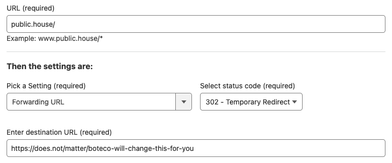

# `boteco`

`boteco` is a CLI to:
* create redirections in CloudFlare to Zoom meetings (so you can have the same URL for different meetings over time)
* adding an additional email address to ImprovMX email redirects

## Requirements

`boteco` only **edits** these redirects, it **does not create** new rules on CloudFlare or aliases in ImprovMX. So you have to create them manually before using `boteco`.

### CloudFlare page rules

In the domain you want to use, you need to create two page rules, one for the public URL and one for the private URL. You can skip any of them if you don't want to use it.

#### Public URL page rule

URL that will redirect to the Zoom meeting without the meeting password embedded in it. For example, if you set the macth rule to `public.house/` this will redirect to something like `https://zoom.us/j/12345678`. Users will need to know and manuall type de password to join.

#### Private URL page rule

URL that will redirect to the Zoom meeting with the meeting password embedded in it. For example, if you set the macth rule to `public.house/only-closest-friends-will-get-this-one` this will be redirect to something like `https://us02web.zoom.us/j/12345678?pwd=abcdef`.

#### Example



### ImprovMX aliases

With the domain you used for the public URL (e.g. `public.house`), create an alias to `host@<domain>` (e.g. `host@public.house`). Then `boteco` will create a redirect from this email to:
* The one set in the `BOTECO_EMAIL` environment variable
* Optionally to an email passed to the CLI

### Environment variables

#### Your domain for the permanent URL

| Variable | Description |
|---|---|
| `BOTECO_PUBLIC_URL` | URL to be redirected to the Zoom meeting without the password  |
| `BOTECO_PRIVATE_URL` | URL to be redirected to the Zoom meeting with the password |
| `BOTECO_EMAIL` | Email address to be used by ImprovMX redirect (in aditional to an aditional one passed to the CLI) |

#### CloudFlare

| Variable | Description |
|---|---|
| `BOTECO_CLOUD_FLARE_API_TOKEN` | API token to access CloudFlare |
| `BOTECO_CLOUD_FLARE_ZONE_ID` | Zone ID of the CloudFlare domain |

#### ImprovMX

| Variable | Description |
|---|---|
| `BOTECO_IMPROVMX_API_KEY` | API key to access ImprovMX |

## Usage

Assuming:

| Environment variable | Set to |
|---|---|
| `BOTECO_PUBLIC_URL` | `public.house/` |
| `BOTECO_PRIVATE_URL` | `public.house/only-closest-friends-will-get-this-one` |
| `BOTECO_EMAIL` | `owner@public.house` |

```console
$ boteco "https://us02web.zoom.us/j/12345678?pwd=abcdef" "friend@public.house"
https://public.house/only-closest-friends-will-get-this-one => https://us02web.zoom.us/j/12345678?pwd=abcdef
https://public.house/ => https://zoom.us/j/12345678
host@public.house => owner@public.house,friend@public.house
```

### Development

Activate debug mode with `RUST_LOG=debug` environment variable.
